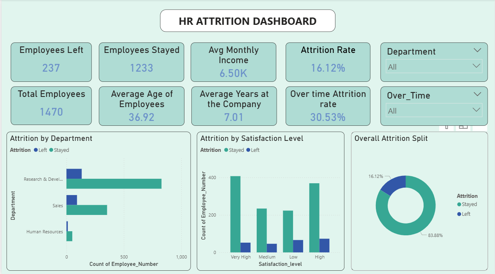

# hr-attrition-analytics-dashboard
HR Attrition Analytics Dashboard built with Power BI and Excel | IBM HR Dataset

## Project Overview
An end-to-end HR analytics dashboard analysing workforce attrition 
patterns across departments, satisfaction levels, and overtime status 
using Power BI and Excel.

**Dataset:** IBM HR Analytics Employee Attrition Dataset (1,470 records)  
**Tools:** Power BI | Microsoft Excel | DAX

---

## Key Findings
- Overall attrition rate: **16.12%**
- Overtime employees leave at **30.53%** — nearly 2× the company average
- Sales department has the highest attrition at **20.6%**
- Low satisfaction employees leave at **2× the rate** of high satisfaction employees

---

## Dashboard Features
- 8 KPI cards: Attrition Rate, Overtime Attrition, Total Employees, Avg Income
- Interactive Department and OverTime slicers
- Attrition by Department bar chart
- Satisfaction vs Attrition column chart
- Overall Attrition donut chart

---

## Files in this Repository
| File | Description |
|------|-------------|
| HR_Dashboard.pdf | Power BI dashboard export |
| HR_Dashboard_Screenshot.png | Dashboard preview |
| HR_Analytics_Clean.xlsx | Cleaned dataset with pivot analysis |

---

## Dashboard Preview

---

*Built by **Anisha G Poojary** | BBA Business Analytics, MAHE | 2026*
*LinkedIn: [anisha-poojary](https://linkedin.com/in/anisha-poojary-a4b6b2286) | Email: anishagpoojary16@gmail.com*
